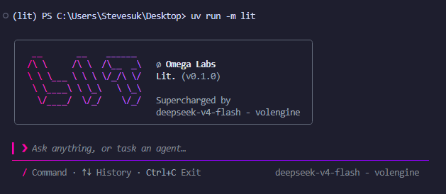

# Lit

**Lit** `(Let's do IT)` is a LLM-powered command-line agent that runs directly in your terminal.

It can read and modify files, execute shell commands, run code,
and help you complete programming tasks through an interactive terminal interface.

---

## Features

- Base file reading, writing, and editing
- Beautiful TUI with cross-platform terminal support
- Persistent project memory
- Plugin support

---

## Quick Start

We strive to make **Lit** easier to use. Since configuring and using other agent software often involves tedious setup and various limitations, we have focused on providing the best possible out-of-the-box experience.

### Prerequisites

- A terminal with truecolor support
- A terminal with truecolor support
- A terminal with truecolor support
- A terminal with truecolor support
- A terminal with truecolor support
- uv

### Install

We use `uv` to manage the Python environment, so you’ll need to install it first:

``` bash
pip install uv
```

Then, you need to clone this repo.

``` bash
# Clone the repository
git clone https://github.com/the-OmegaLabs/lit.git
cd lit

# Install dependencies
uv sync
```

### Configure

Open the **Lit** folder and edit `config.py` to set your API key and model:

```python
# API server endpoint URL. Require an OpenAI-compatible endpoint:
base_url = 'https://api.example.com/api/v1'

# API authentication key. Used to verify your identity when calling the API.
api_key = 'your-api-key-here'

# Model displaying name. Specifies which AI model in system prompt and UI.
model = 'gpt-5.6-sol - Example Provider'

# Model identifier id. Specifies which AI model in requests.
model_id = 'gpt-5.6-sol'

# ==========================
# UI Configuration
# ==========================

# Whether to enable the alternative theme.
#
# False:
#   Use the default color theme: Magentic
#
# True:
#   Switch to the alternate theme: Ocean
use_alt_theme = False
```

You're all set.

### Run

```bash
uv run -m lit
```
or open the **lit** folder and run the `app.py` directly.

---

## 🤝 Contributing

**Lit** is an open-source project led by **Omega Labs**. Contributions, issues, and feature requests are welcome.

---

## 📄 License

License information will be announced later.